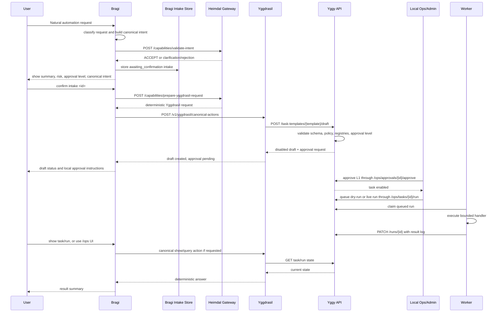
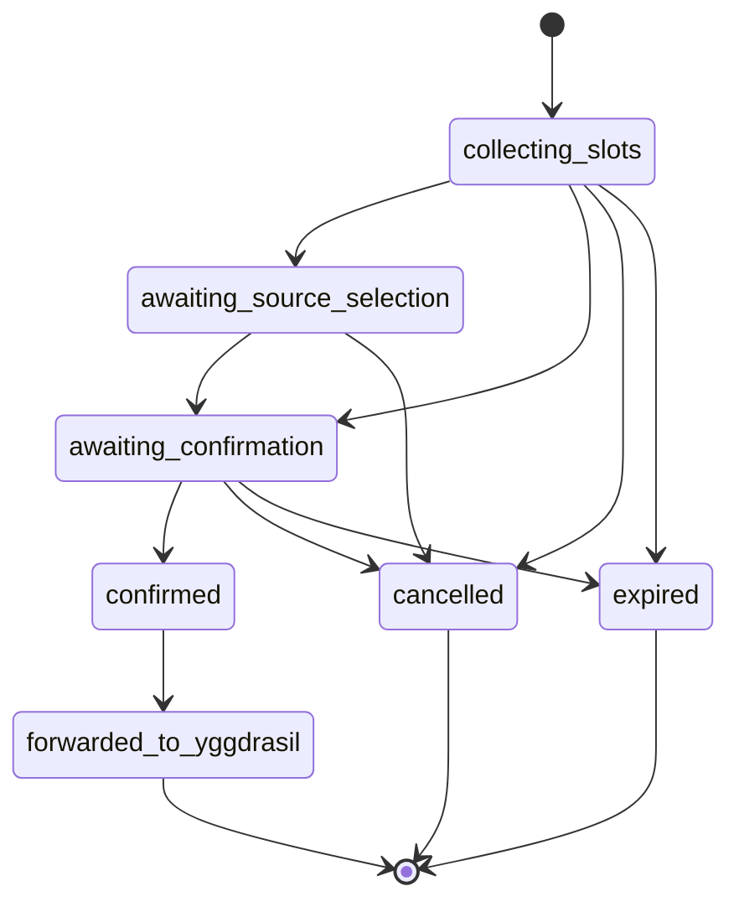
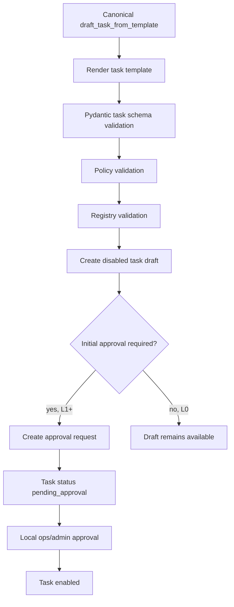
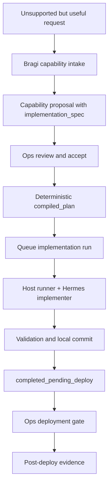
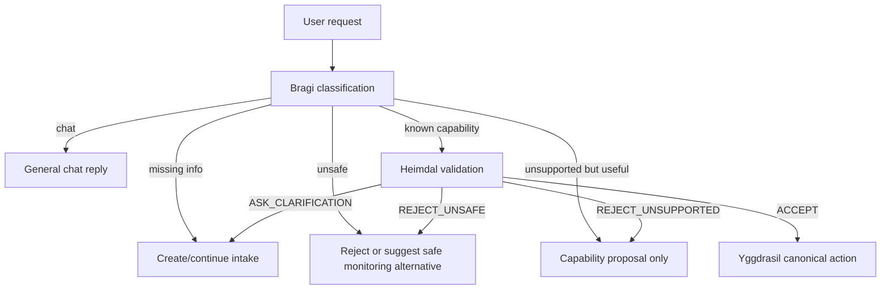

# Automation Request Pipeline

This document describes the implemented request pipeline from Bragi to Yggy and
back. It is the operator-facing description of how a natural automation request
becomes a validated draft, approval request, worker run, and user-visible
result.

## Roles

```text
Bragi
  Natural human-facing agent. Bragi chats, gathers slots, creates intake state,
  and asks for user confirmation. Bragi is not an execution authority.

Heimdal
  Capability gateway inside the automation API. Heimdal validates canonical
  intents against the explicit capability registry and prepares deterministic
  Yggdrasil requests.

Yggdrasil
  Deterministic automation coordinator. Yggdrasil accepts only canonical
  actions and calls the Yggy automation API through the tool role.

Yggy automation API
  Policy, approval, task, run, audit, registry, and validation authority.

Local ops/admin path
  Operator-controlled approval and manual run surface. This path can approve L1
  requests without exposing admin secrets to Bragi.

Automation worker
  Executes approved bounded task types and writes run logs back to Yggy.
```

## Creation Flow



## Request Classification

Bragi first decides whether the user is chatting or asking for automation work.
The deterministic goal router classifies automation requests as:

```text
list_existing
inspect_existing
run_existing
pause_existing
modify_existing
create_new
propose_new_capability
unsafe
needs_clarification
chat
```

Only known, supported automation requests are converted to canonical intents.
Unsupported chat stays chat. Ambiguous automation requests create intake state
instead of being forced toward Yggdrasil.

## Intake States



Important distinction:

```text
User confirmation
  Confirms that Bragi understood the request and may forward the canonical
  intent to Heimdal/Yggdrasil.

Yggy approval
  Authorizes the generated task according to policy. User confirmation is not
  approval.
```

## Capability Gateway

Heimdal validates canonical intents against `configs/capabilities.yaml`.

For accepted task drafts, Heimdal returns a deterministic request:

```json
{
  "action": "draft_task_from_template",
  "capability_id": "topic_digest.v1",
  "template_id": "topic_digest",
  "template_values": {
    "id": "example_digest",
    "name": "Example Digest",
    "cron": "0 8 * * *",
    "timezone": "Europe/Berlin",
    "output_target": "briefings",
    "source_ids": ["docker_blog"]
  }
}
```

Heimdal rejects or asks for clarification when:

```text
required slots are missing
capability_id is unknown
source IDs are not approved
webhook IDs are not approved
output target is not whitelisted
unsafe keywords are present
requested approval level exceeds the capability
raw webhook URLs are supplied
raw natural language is included on the canonical action path
```

## Yggdrasil Canonical Actions

Yggdrasil is intentionally narrow. It accepts deterministic canonical actions:

```text
list_tasks
show_task
run_task
pause_task
draft_task_from_template
propose_task_change
show_run
list_runs
```

Yggdrasil does not interpret arbitrary user prose on this path. If raw natural
language appears in a canonical action payload, it is rejected.

## Draft And Approval Path



L1 approvals can be accepted by a local authenticated ops/admin operator without
showing an approval nonce to Bragi. L2 and above still require stricter handling
and may require a nonce or manual-only process depending on policy.

## Worker Execution Path

```mermaid
flowchart TD
    A[Task run queued] --> B[Worker polls /runs]
    B --> C[Worker claims run]
    C --> D{Task type}
    D -->|topic_digest| E[Fetch approved sources and summarize]
    D -->|server_health| F[Check approved health endpoints]
    D -->|n8n_webhook| G[Dispatch approved webhook or dry-run]
    D -->|printer_supply_status| H[Check approved printer endpoints]
    D -->|tls_certificate_expiry| I[Check approved TLS endpoints]
    E --> J[Notification decision]
    F --> J
    G --> J
    H --> J
    I --> J
    J -->|dry-run| K[No external send; record preview/result]
    J -->|live and allowed| L[Send through approved bridge]
    K --> M[PATCH /runs/{id}]
    L --> M
```

The worker executes only task types implemented in code. It does not receive raw
human instructions and does not decide policy.

## Return Paths

The user can inspect outcome through several bounded paths:

```text
Bragi natural request
  -> deterministic show/list/run query
  -> Yggdrasil canonical action
  -> Yggy API task/run data
  -> Bragi answer

Ops UI
  -> /ops tasks, approvals, runs, review queues

API/CLI
  -> GET /tasks/{task_id}
  -> GET /runs/{run_id}
```

Run logs are redacted by the automation API before model-facing return paths.

## Unsupported Capability Development Path

Useful unsupported requests do not go to Yggdrasil as executable natural
language. Bragi creates or continues a capability-development intake and then
submits a non-executable capability proposal when the required facts are known.



The implementation path can write repository code only through the host-side
runner. It does not create tasks, approve tasks, run automations, push code, or
deploy without the explicit ops deployment gate.

## Safety Boundaries

Hard boundaries preserved by this pipeline:

```text
Bragi does not receive the admin API key.
Bragi does not approve tasks.
Bragi does not receive approval nonces.
Bragi does not receive shell, Docker socket, host filesystem, or raw webhook URL authority.
Open WebUI/Hermes do not receive admin credentials.
External source content is data, not command authority.
Generated tasks start disabled and dry-run.
Yggy API remains the state and policy authority.
Worker execution is bounded to approved task handlers.
```

## Failure And Rejection Paths



This keeps a friendly face without making the friendly face an execution
authority.
