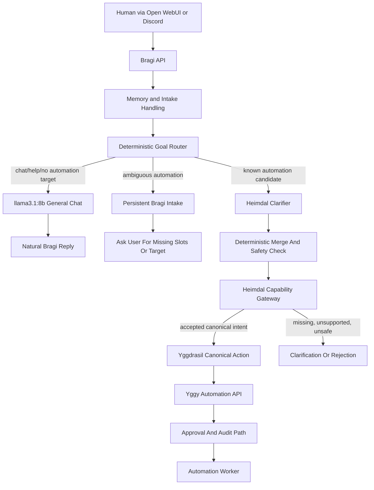
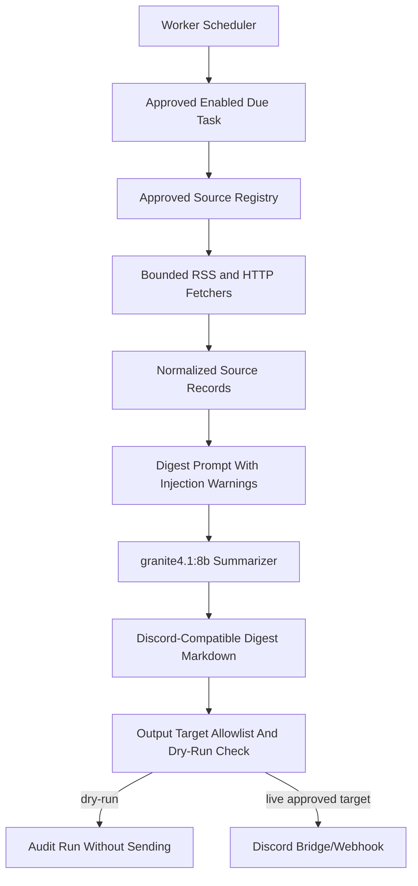
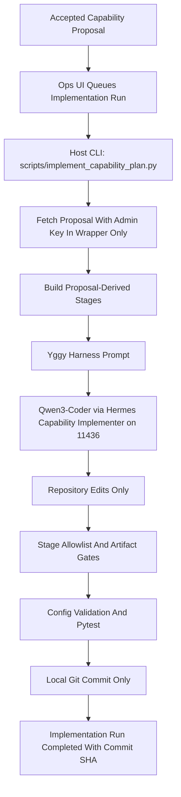
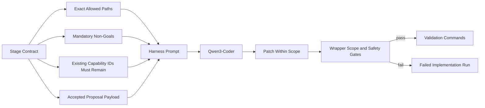
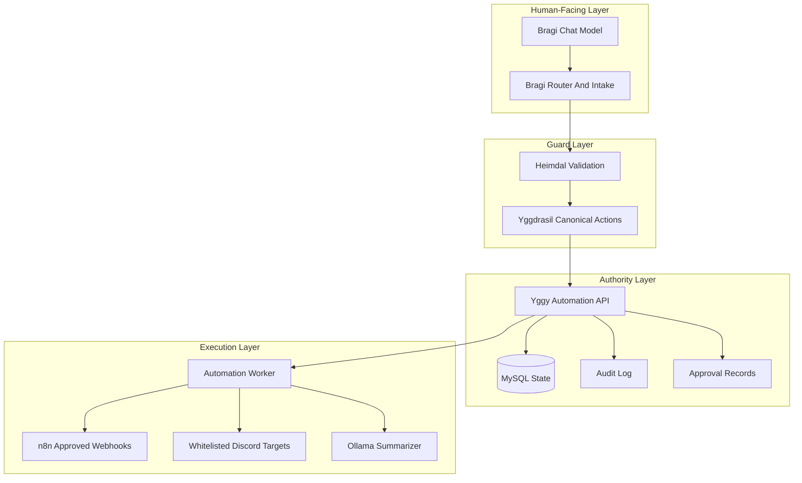

# Local Model Stack Architecture

This document describes the implemented local model-routing architecture for
Yggy, Bragi, Heimdal, Yggdrasil, the automation worker, and the host-side
capability implementation harness.

The model stack is intentionally role-specific. Bragi keeps its general chat
model for personality. Deterministic automation routing remains guarded by
Bragi's router, Heimdal validation, Yggdrasil canonical actions, and the Yggy
automation API. Qwen3-Coder is reserved for bounded repository implementation
work where the wrapper can give it exact Yggy harness constraints.

## Implemented Model Roles

| Role | Model | Path | Reason |
| --- | --- | --- | --- |
| Bragi general chat | `llama3.1:8b` | `BRAGI_CHAT_MODEL` | Keeps the more natural Bragi voice for ordinary conversation. |
| Existing-task/tool-loop style routing probe | `granite4.1:8b` or `hf.co/ibm-granite/granite-4.1-8b-GGUF:Q4_K_M` | Yggdrasil intent fallback, worker summarizer, tool-capable probes | Tested native Ollama `message.tool_calls` support and low latency. |
| Worker digest summarization | `granite4.1:8b` | `LLM_SUMMARIZER_MODEL` | Produces bounded digest text while treating source records as untrusted data. |
| Capability implementation planning | `hf.co/unsloth/Qwen3-Coder-30B-A3B-Instruct-GGUF:UD-Q4_K_XL` | `YGGY_IMPLEMENTATION_HERMES_MODEL` | Stronger code-planning model, but only safe behind exact harness constraints. |
| Fast fallback code/classification helper | `qwen2.5-coder:7b` | Manual or future bounded fallback | Fast structured JSON for small local tasks; not preferred for native tool loops. |

Current repository defaults preserve Bragi personality:

```env
BRAGI_OLLAMA_BASE_URL=http://host.docker.internal:11435
BRAGI_CHAT_MODEL=llama3.1:8b
LLM_SUMMARIZER_MODEL=granite4.1:8b
YGGY_IMPLEMENTATION_OLLAMA_HOST=http://127.0.0.1:11436
YGGY_IMPLEMENTATION_HERMES_MODEL=hf.co/unsloth/Qwen3-Coder-30B-A3B-Instruct-GGUF:UD-Q4_K_XL
```

## Dedicated Ollama Lanes

Bragi's chat model is intentionally kept on a separate Ollama listener from
heavy implementation work. This prevents long Qwen3-Coder runs from occupying
the same model-server context that serves ordinary Bragi conversation.

| Lane | Host listener | Primary model | Unit template | Purpose |
| --- | --- | --- | --- | --- |
| Bragi chat | Docker host gateway `172.17.0.1:11435` | `llama3.1:8b` | `deploy/systemd/ollama-bragi.service` | Low-latency no-tool chat/personality replies for Dockerized Bragi. |
| Capability implementation | `127.0.0.1:11436` | `hf.co/unsloth/Qwen3-Coder-30B-A3B-Instruct-GGUF:UD-Q4_K_XL` | `deploy/systemd/ollama-implementation.service` | Heavy repository implementation through the bounded Hermes harness. |
| General/default | `127.0.0.1:11434` | deployment-specific | existing Ollama service | Worker summarization or other local defaults not bound to Bragi chat. |

Both dedicated services use the same local Ollama model directory, so models do
not need to be downloaded twice. The Bragi listener is bound to the Docker host
gateway instead of LAN-facing interfaces; if your Docker host gateway is not
`172.17.0.1`, adjust `deploy/systemd/ollama-bragi.service` and keep
`BRAGI_OLLAMA_BASE_URL` pointed at `host.docker.internal`. The implementation
runner passes
`YGGY_IMPLEMENTATION_OLLAMA_HOST` to Hermes and stops the configured
implementation model after each run. Bragi uses `BRAGI_OLLAMA_BASE_URL`, falling
back to `OLLAMA_BASE_URL` only when the dedicated setting is absent.

## Conversation And Automation Routing

Bragi is the human-facing layer. Ordinary chat stays in Bragi and uses the chat
model. Automation requests are classified before anything reaches Yggdrasil.
Unsupported chat should not be forced into an automation flow.



### Guarantees

- Bragi general chat does not approve, run, pause, or modify tasks.
- Bragi can create or continue intake state, but execution authority stays out
  of chat and memory.
- The clarifier is advisory only. Its output is merged with deterministic
  routing and still validated.
- Yggdrasil receives deterministic canonical actions only.
- Yggy API remains the state, policy, approval, and audit authority.

## Worker Digest Summarization

The automation worker may use the configured summarizer for topic digests. This
path is separate from Bragi's personality model. Source records are treated as
untrusted data and are never command authority.



### Summarizer Constraints

- The worker does not expose shell, Docker, host filesystem write, or arbitrary
  webhook authority to the model.
- Source titles, summaries, links, and feed text are data records only.
- The prompt asks for bounded Markdown with source links and no hidden
  reasoning.
- Output sending still obeys task policy, dry-run mode, and target allowlists.

## Capability Implementation Harness

Qwen3-Coder is used only for local repository implementation work. The host-side
wrapper fetches an accepted capability proposal and turns it into staged prompts
with explicit constraints. The model does not receive admin API keys, approval
nonces, live Discord webhooks, production `.env`, Docker authority, or deployment
authority.



### Harness Prompt Contract

Every staged implementation prompt now contains a plain-text harness section in
addition to the structured JSON payload. This was added because Qwen3-Coder
behaved correctly only when the allowed repository paths and non-goals were made
explicit outside the JSON payload.

The harness section includes:

- exact allowed repository paths for the stage
- instruction to stop with a blocker instead of widening scope
- instruction not to invent substitute roots such as `capabilities/`,
  `proposals/`, `metrics/`, or `.env`
- instruction to copy every mandatory boundary verbatim when returning JSON
  safety fields such as `explicit_non_goals`
- mandatory non-goals:
  - no shell execution by Bragi
  - no Docker socket access
  - no admin approvals or approval nonces
  - no secrets in prompts, configs, logs, or chat
  - task templates remain disabled and dry-run by default
  - Heimdal validates before any Yggdrasil canonical action



## Authority Boundaries



The model stack does not change the security model:

- Model-facing components do not receive admin keys.
- Bragi does not get shell, Docker, host filesystem, firewall, or arbitrary
  webhook tools.
- Qwen3-Coder does not implement live changes directly in production; it edits a
  repository workspace through the host wrapper and must pass validation.
- User confirmation confirms Bragi understood the user. Yggy approval remains a
  separate authority decision.

## Validation Snapshot

The implementation is covered by the following validation paths:

```bash
python3 scripts/validate_configs.py
.venv/bin/pytest bragi/tests/test_goal_router.py \
  bragi/tests/test_goal_clarifier.py \
  yggdrasil/tests/test_action_router.py \
  automation-api/tests/test_capability_implementation_harness.py \
  automation-api/tests/test_capability_implementation_runs.py \
  automation-worker/tests/test_llm_client.py
docker compose -f docker-compose.automation.yml config
```

The live model probes used for this architecture check:

- Granite emitted native Ollama tool calls for deterministic task operations.
- Granite produced bounded digest Markdown and ignored a source-record injection.
- Qwen3-Coder produced valid repository planning JSON only when supplied exact
  Yggy harness constraints.
- qwen2.5-coder:7b produced fast structured fallback classification JSON.
