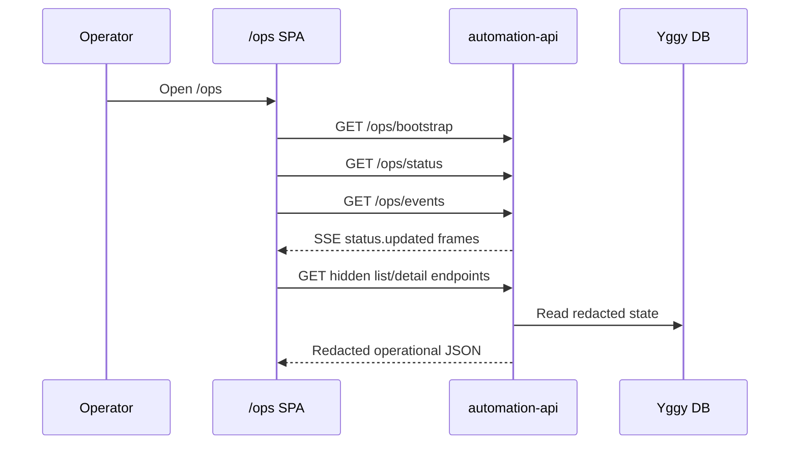
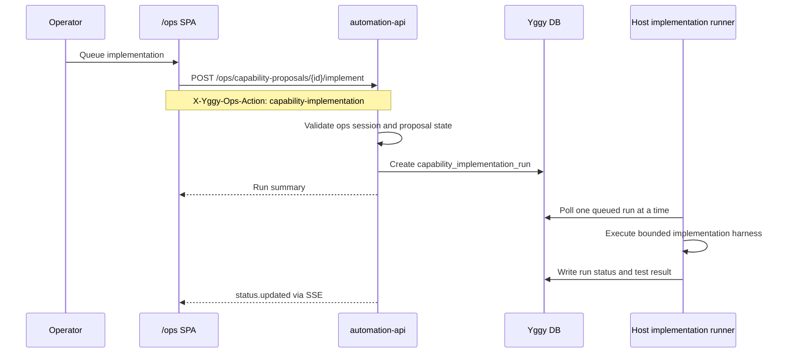

# Yggy Operations UI Architecture

The `/ops` surface is now a bundled React/Vite single-page application served
by the `automation-api` container. It is intentionally not a separate trusted
service. The browser receives only the same redacted, local-only JSON views that
the legacy dashboard used.

The preserved legacy dashboard remains available at:

```text
/ops/legacy
```

## Boundary Model

The SPA does not receive admin API keys, worker keys, approval nonce hashes,
webhook URLs, Docker access, shell access, or host filesystem access. All
state-changing calls still require:

- an authenticated `/ops` browser session or explicitly authorized admin access
- the hidden `/ops/*` route
- the matching `X-Yggy-Ops-Action` header
- existing automation API policy checks

The frontend is a usability layer only. It does not approve, run, archive, plan,
or implement anything by itself.

```mermaid
flowchart LR
    Browser[Operator browser] --> Login[/ops/login]
    Login --> Cookie[Signed HttpOnly ops cookie]
    Browser --> SPA[/ops React SPA]
    SPA --> Bootstrap[/ops/bootstrap]
    SPA --> Events[/ops/events SSE]
    SPA --> OpsApi[/ops JSON endpoints]
    OpsApi --> Policy[automation-api policy checks]
    Policy --> DB[(Yggy database)]
    Policy --> WorkerQueue[Run and implementation queues]

    Bragi[Bragi and Open WebUI] -. no admin keys .-> YggyApi[Yggy API]
    Bragi -. no direct access .x OpsApi
```

## Served Assets

The Docker image builds the UI in a Node stage and copies the compiled Vite
bundle into:

```text
automation-api/app/ops_static
```

At runtime:

- `/ops` serves the SPA `index.html`
- `/ops/assets/*` serves compiled static assets
- `/ops/legacy` serves the previous inline dashboard
- `/ops/bootstrap` serves non-secret navigation, feature, and security metadata
- `/ops/events` serves authenticated server-sent events for live refresh

If the compiled bundle is missing during local source-tree development, `/ops`
serves a small fallback page that links to `/ops/legacy`.

## UI Flows





## Views

The SPA is organized around the operator's daily workflows:

- **Builder**: capability proposals, capability gap routing, and implementation runs.
- **Tasks**: existing automations, dry-run/live-run controls, pause/resume, archive, and redacted task detail.
- **Runs**: execution history with filters and redacted run details.
- **Reviews**: pending approvals and task-change proposal decisions.
- **Sources**: source proposal approval and apply workflow.
- **Audit**: server-side filtered audit trail.
- **System**: runtime status, retention state, and frontend boundary metadata.

The top attention queue aggregates pending reviews, source proposals, capability
proposals, active runs, and recent failures so the operator can start from the
highest-signal queue instead of scanning every table.

## Action Header Contract

The SPA uses the existing hidden action headers:

```text
approval-decision
manual-run
task-state
task-archive
version-revert
task-change-proposal
capability-proposal
capability-implementation
capability-gap
source-proposal
```

These headers remain server-enforced. A button in the browser is not authority;
it is only a convenient way to submit an already-authenticated local operator
request to the API.

## Live Updates

The frontend opens `/ops/events` after login. The stream emits:

```text
ops.ready
status.updated
```

The current implementation sends compact non-secret counts, worker status, and
latest run metadata. The UI still polls as a fallback, so loss of SSE does not
block operator work.

## Development

Local frontend build:

```bash
cd automation-api/ops-ui
npm install
npm run build
```

The production Docker build runs the same build in a Node stage:

```bash
docker compose -f docker-compose.automation.yml build automation-api
```

The runtime image remains Python-based and does not include Node as an execution
dependency.
